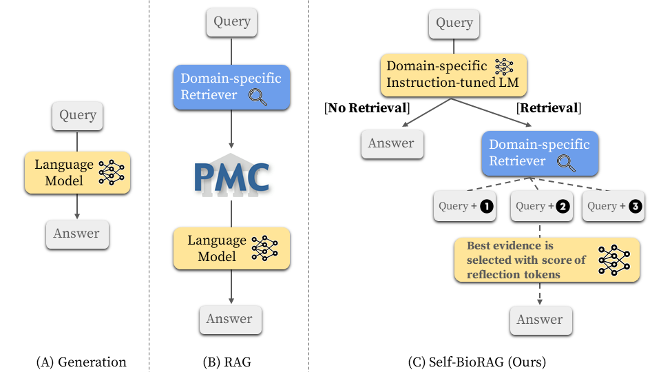

# Self-BioRAG: Improving Medical Reasoning through Retrieval and Self-Reflection with Retrieval-Augmented Large Language Models

This is a repository for [Improving Medical Reasoning through Retrieval and Self-Reflection with Retrieval-Augmented Large Language Models]()
 by Minbyul Jeong, Jiwoong Sohn, Mujeen Sung, and Jaewoo Kang.

[7B Model](https://huggingface.co/selfbiorag/selfbiorag_7b) | [13B Model](https://huggingface.co/selfbiorag/selfbiorag_13b) | [Paper]() | [Training data]() | [Summary]()

**Self-BioRAG** is a framework reliable for biomedical and clinical text instructions that specializes in self-reflection to retrieve, criticize, and generate explanations while preserving generation quality and reasoning ability.

The retrieval-augmented generation (RAG) framework performs document searches unconditionally, regardless of whether a query requires document retrieval. However, **Self-BioRAG** framework use domain-specific instruction-tuned language model to predict whether retrieval is necessary for given query. If the query doesn't require any retrieval of knowledge (factual contents), it directly predicts the answer. If the query necessitates retrieval knowledge, **Self-BioRAG** utilizes the domain-specific retriever (MedCPT, in our case) to retrieve relevant documents. After retriever the top-k evidence, the language model selects the most pertinent evidence for the query. Ultimately, our language model is employed to select the best evidence and generate the answer based on the selected evidence and encoded knowledge.



## Updates
* \[**Jan 26, 2024**\] **Self-BioRAG** has been released.

## Content
1. [Installation](#installation)
2. [Quick Usage](#quick-usage)
3. [Overall Workflow](#overall-workflow)
4. [Retriever](#retriever)
5. [Critic LM](#critic-lm)
6. [Generator LM](#generator-lm)
7. [Inference](#inference)
8. [FAQ](#faq)
9. [Citation](#citation)
10. [Contact Information](#contact-information)

## Installation
Please create a conda environment by running the command below.

```
conda env create -f selfbiorag.yaml
```

If you try to install Python libraries through requirements by running the command below.
```
conda create -n selfbiorag python=3.10
pip install -r requirements.txt
```

## Quick Usage
You can download Self-BioRAG from HuggingFace hub.
For inference, we recommend using [vllm](https://vllm.readthedocs.io/en/latest/) to speed up inference.
```py
from vllm import LLM, SamplingParams

model = LLM("selfbiorag/selfbiorag_7b", download_dir=your_download_path_to_load, dtype="half")

```


## Overall Workflow
overall workflow


## Retriever
retriever

## Critic LM
critic lm

## Generator LM
generator lm

## Inference
inference 

## FAQ
FAQ

## Citation
Citation

## Contact Information
For help or issues using **Self-BioRAG**, please submit a GitHub issue. Please contact Minbyul Jeong (`minbyuljeong (at) korea.ac.kr`) for communication related to **Self-BioRAG**.


